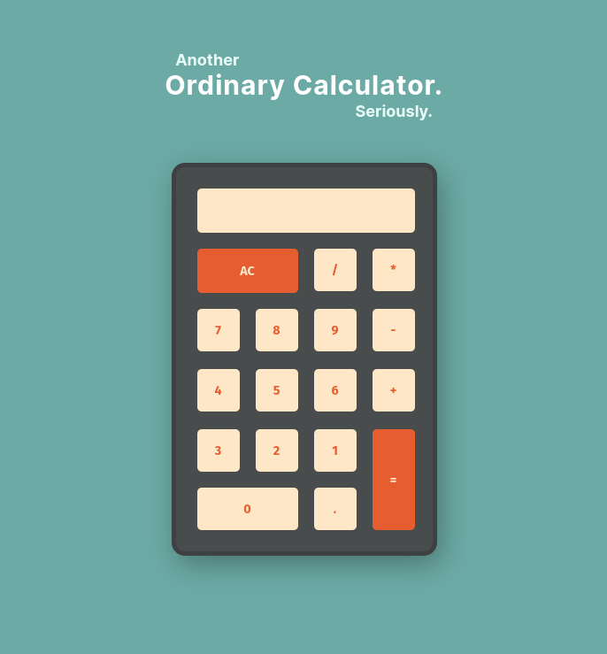
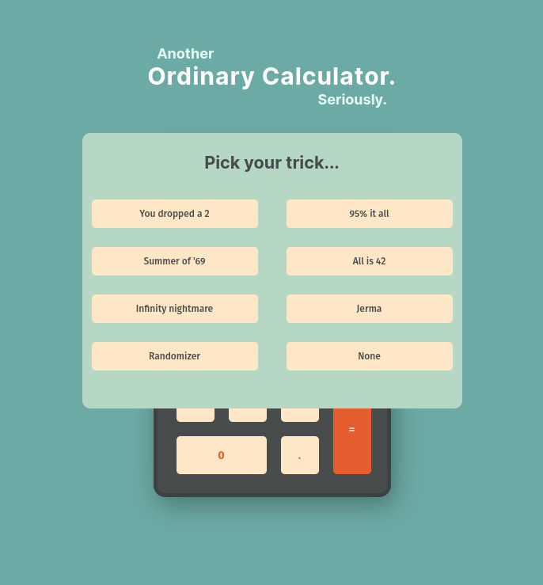
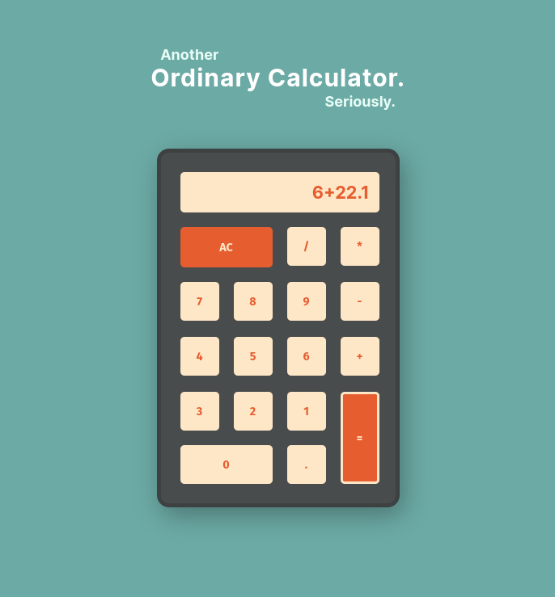

# ANOTHER ORDINARY CALCULATOR

### Calculations - *with a twist!*

Another Ordinary (evil) Calculator is a handy-dandy tool used to befuddle your enemies with horrendously incorrect
calculations, should you so choose, spiralling them to *insanity*.

### Learning Outcomes

My learning outcomes for this project were to create an ordinary (evil) calculator with the use of TypeScript.

This small project has been a joy to work on, and is my first TypeScript project to date. While it was at times a
challenge to understand the types of certain elements, such as MouseEventHandler, it never gave much trouble and the
benefits of a statically typed language are clear and I wish to use TypeScript more in the future.

In addition to TypeScript, the code itself features tokenization to identify, categorize and manipulate tokens within
the equation based on set conditions to properly evaluate mathematical expressions.

Feel free to check out the
<a href="https://inquisitive-sprite-15362c.netlify.app/">running version on Netlify</a>
and the
<a href="https://www.figma.com/file/xU1a9rYhIuuQxJqgxv7GUS/Untitled?type=design&node-id=0%3A1&mode=design&t=59XbRIX2gdCFvFhn-1">
Figma design file</a>.

### Tools Used

- TypeScript
- Figma
- React / Vite
- <a href="https://www.npmjs.com/package/mathjs">Mathjs</a>

### What's Next?

- More (evil) options
- Keyboard support

### More Screenshots

